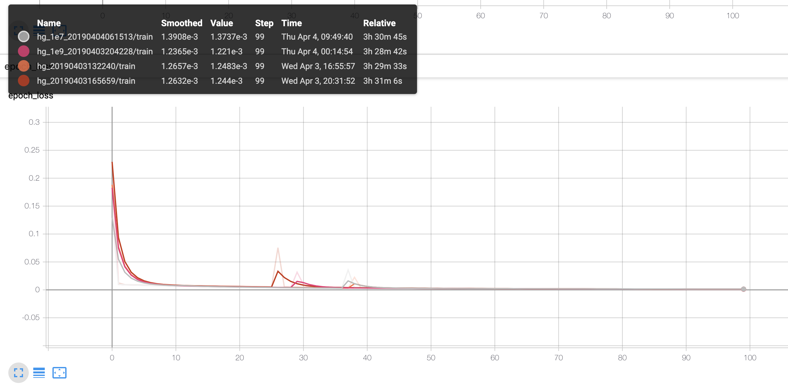
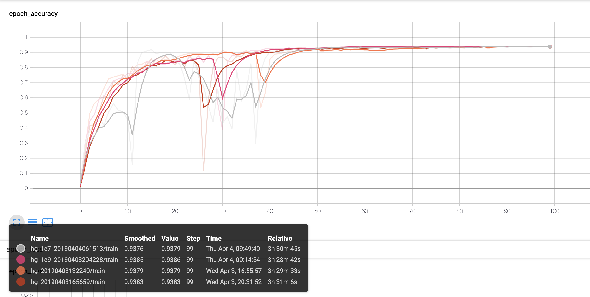

# 💃 Mobile Pose Estimation for TensorFlow 2.0
> ~~This repository is forked from [edvardHua/PoseEstimationForMobile](https://github.com/edvardHua/PoseEstimationForMobile) when the original repository was closed.~~ <br>[edvardHua/PoseEstimationForMobile](https://github.com/edvardHua/PoseEstimationForMobile) repository is reopened! I'll maintain it separately. 👍


This repository currently implemented the Hourglass model using TensorFlow 2.0 (and Keras API). Instead of normal convolution, inverted residuals (also known as Mobilenet V2) module has been used inside the model for **real-time** inference.

## Table of contents

- [Goals](#goals)
- [Getting Started](#getting-started)
- [Results](#results)
- [Converting To Mobile Model](#converting-to-mobile-model)
- [Tuning](#tuning)
- [Details](#details)
    - [Folder Structure](#folder-structure)
    - [Main Components](#main-components)
- [TODO](#todo)
- [Related Projects](#related-projects)
- [Acknowledgements](#acknowledgements)
- [Reference](#reference)
- [Contributing](#contributing)
- [License](#license)

## Goals

- 📚 Easy to train
- 🏃‍ Easy to use the model on mobile device

## Getting Started

### Install Anaconda (~10 min)

[How To Install Anaconda on Ubuntu 18.04 [Quickstart]](https://www.digitalocean.com/community/tutorials/how-to-install-anaconda-on-ubuntu-18-04-quickstart)

### Create Virtual Environment (~2 min)

Create new environment.
```shell
conda create -n {env_name} python={python_version} anaconda
# in my case
# conda create -n mpe-env-tf2-alpha0 python=3.7 anaconda
```

Start the environment.
```shell
source activate {env_name}
# in my case
# source activate mpe-env-tf2-alpha0
```

### Install the requirements (~1 min)
```shell
cd {tf2-mobile-pose-estimation_path}
pip install -r requirements.txt
```

## Run The Project

In order to use the project you have to:
1. Prepare the dataset([ai_challenger dataset](https://drive.google.com/open?id=1zahjQWhuKIYWRRI2ZlHzn65Ug_jIiC4l)) and locate the dataset on `./datasets`.
2. Run the model using:
```shell
python train.py
```
3. Monitoring with TensorBoard:
```shell
tensorboard --logdir="./outputs/logs"
```

## Results

### Loss


### Accuracy


## Converting To Mobile Model

### TensorFLow Lite

1. Prepare the trained model(`.hdf5`) from section below [Run The Project](#run-the-project)
2. Modify `trained_model_file_name` variable in `convert_to_tflite.py` to your own trained model.
```python
trained_model_file_name = "{model_file_name}.hdf5"
```
3. Run the `convert_to_tflite.py`:
```shell
python convert_to_tflite.py
```
4. And then, you can find the `.tflite` model on `{PROJECT_PATH}/outputs/models/tflite/{model_file_name}.tflite`.

### Core ML (Preparing...)

> Related issue: [https://github.com/tucan9389/tf2-mobile-pose-estimation/issues/13](https://github.com/tucan9389/tf2-mobile-pose-estimation/issues/13)

## Details

> This section will be separated to other `.md` file.

### Folder Structure

```
├── train.py            - the main script file
├── data_loader.py      
├── data_augment.py     
├── data_prepare.py     
├── hourglass_model.py  
├── model_config.py     
├── network_base.py     
├── path_manage.py      
├── train_config.py     
├── requirements.txt    
├── datasets            - this folder contain the datasets of the project.
|   └── ai_challenger
|       ├── ai_challenger_train.json
|       ├── ai_challenger_valid.json
|       ├── train
|       └── valid
└── outputs             - this folder will be generated automatically when start training
    ├── models
    └── logs
```

## TODO

- ~~Save model(`.hdf5` or `.ckpt`)~~
- ~~Convert the model(`.hdf5` or `.ckpt`) to TFLite model(`.tflite`)~~
- Convert the model(`.hdf5` or `.ckpt`) to Core ML model(`.mlmodel`)
- Run the model on Android
- Run the model on iOS
- Make DEMO gif running on mobile device

## Acknowledgements
This project is based on [edvardHua/PoseEstimationForMobile](https://github.com/edvardHua/PoseEstimationForMobile) and [jwkanggist/tf-tiny-pose-estimation](https://github.com/jwkanggist/tf-tiny-pose-estimation).

## Reference

[1] [Paper of Convolutional Pose Machines](https://arxiv.org/abs/1602.00134) <br/>
[2] [Paper of Stack Hourglass](https://arxiv.org/abs/1603.06937) <br/>
[3] [Paper of MobileNet V2](https://arxiv.org/pdf/1801.04381.pdf) <br/>
[4] [Repository PoseEstimation-CoreML](https://github.com/tucan9389/PoseEstimation-CoreML) <br/>
[5] [Repository of tf-pose-estimation](https://github.com/ildoonet/tf-pose-estimation) <br>
[6] [Devlope guide of TensorFlow Lite](https://github.com/tensorflow/tensorflow/tree/master/tensorflow/docs_src/mobile/tflite) <br/>
[7] [Mace documentation](https://mace.readthedocs.io)

### Related Projects
- [tucan9389/PoseEstimation-CoreML](https://github.com/tucan9389/PoseEstimation-CoreML)
- [tucan9389/KeypointAnnotation](https://github.com/tucan9389/KeypointAnnotation)
- [edvardHua/PoseEstimationForMobile](https://github.com/edvardHua/PoseEstimationForMobile)
- [jwkanggist/tf-tiny-pose-estimation](https://github.com/jwkanggist/tf-tiny-pose-estimatio)
- [dongseokYang/Body-Pose-Estimation-Android-gpu](https://github.com/dongseokYang/Body-Pose-Estimation-Android-gpu)

### Other Pose Estimation Projects

- [cbsudux/awesome-human-pose-estimation](https://github.com/cbsudux/awesome-human-pose-estimation)

## Contributing
> This section will be separated to other `.md` file.

Any contributions are welcome including improving the project.

# License

[Apache License 2.0](LICENSE)
